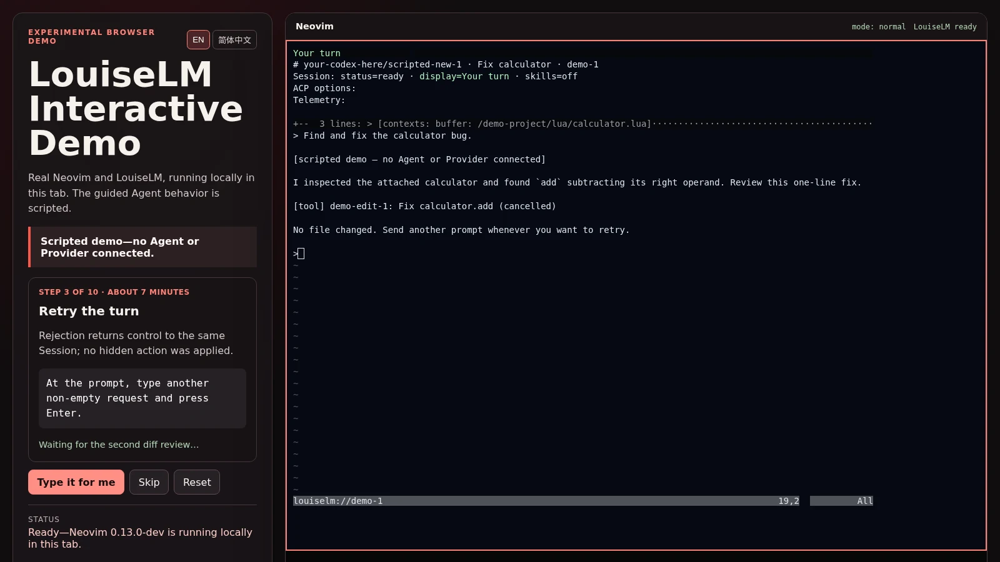

# LouiseLM

**Chat with ACP Agents inside Neovim.**

LouiseLM runs the Agent commands you configure and gives each one a streaming
chat Session. Keep several Sessions open, attach editor context, review file
edits and permissions, invoke Agent Skills, hand work to another Agent, and
inspect raw tool activity or export the full transcript. Documented or tested
paths include Codex, Claude, DeepSeek, OpenCode, and GitHub Copilot.

**[Try LouiseLM in your browser](https://louiselm.com/demo/)** — no installation,
Agent, Provider, credentials, or project files required. The guided Agent
behavior is clearly labelled and scripted; the Neovim and LouiseLM UI are real.

> [!IMPORTANT]
> LouiseLM is alpha software for Neovim 0.12 and newer. Commands and APIs may
> change. LouiseLM does not install Agents or manage their credentials.

[Open the Tutor](docs/tutorial.md) · [Agents and adapters](#agents-and-adapters) ·
[Vim help](doc/louiselm.txt) · [Headless API](doc/api.md)



_The left pane is the scripted browser guide; the right pane is LouiseLM's
real Neovim UI. No Agent or Provider is connected._

## Start here

Already configured? Open the in-editor Tutor:

```vim
:LouiselmTutor
```

The Tutor works even before an Agent is ready. It walks through the health
check, a first prompt, permissions, context, cancellation, and Session controls.

For a first chat you need one installed and authenticated ACP Agent. Codex is
the shortest documented path; install `codex-acp` using its
[official instructions](https://github.com/agentclientprotocol/codex-acp#installation).

Install `sqlite3` 3.38 or newer with JSON support on `PATH` (for example,
`sudo apt install sqlite3` on Debian/Ubuntu). Every Session records private
turn metadata before sending a prompt. Recording failures hold new prompts;
active work can finish. See [durable turn recording](docs/turn-recording.md)
for storage, recovery, and the asynchronous headless API contract.

The public source download is not available yet. If you have a checkout,
replace the path below and save this as `quickstart.lua`:

```lua
vim.opt.runtimepath:prepend("/absolute/path/to/louiselm")

assert(require("louiselm").setup({
  agents = {
    codex = { command = "codex-acp", provider = "OpenAI" },
  },
}))
```

Start an isolated Neovim, then check the setup and chat:

```sh
nvim --clean -u quickstart.lua
```

```vim
:checkhealth louiselm
:LouiselmTutor
:LouiselmChat
```

The quickstart does not modify your normal Neovim configuration. Move the same
setup block into your regular configuration when ready, or see the
[Agent table](#agents-and-adapters) for other paths.

Every Agent must declare its access/quota `provider`, independently of the Model
manufacturer: a Model reached through GitHub Copilot has Provider `GitHub Copilot`.
For an Agent whose advertised option values identify services by namespace,
configure a literal prefix map (the option ID need not be `model`):

```lua
provider = {
  option = "model",
  prefixes = {
    ["opencode-go/"] = "OpenCode Go",
    ["opencode/"] = "OpenCode Zen",
    ["deepseek/"] = "DeepSeek",
  },
}
```

These mappings are explicit configuration, not built-in Agent-specific rules.
New Models under a configured prefix need no config edit. Prefixes are nonempty,
literal and case-sensitive: no patterns or longest-match precedence. Missing or
non-string option values, no match, and multiple matches refuse attribution;
even overlapping prefixes naming the same service are ambiguous.

When attribution depends on multiple options or exact values, use routes instead:

```lua
provider = {
  { provider = "OpenAI", options = { model = "openai/example-model" } },
  { provider = "GitHub Copilot", options = { model = "github-copilot/example-model" } },
}
```

Use the option IDs and values your Agent actually advertises, and map the service
supplying your access. All entries in a route's `options` must match, including
boolean values. Exactly one route or prefix must match before either Chat or the
headless Session API sends a prompt. Missing configuration fails setup; missing or
ambiguous active routes leave the Session ready and report how to fix attribution.
`Session:inspect().turn_identity` preserves Agent, Provider, advertised Model,
and the complete supported option tuple at prompt start; later option changes
do not rewrite it. This snapshot does not yet persist usage history.

## Features

- **Chat in Neovim.** Stream replies, reasoning when supplied, tool activity,
  context usage, and cost or account limits when the Agent reports them.
- **Use several Agents and Sessions.** Create, switch, rename, and close
  independent Sessions. Resume history when the Agent supports ACP Session
  discovery and loading. With at least two Agents configured, a reviewed
  Handoff opens a separate Session while preserving the source Session.
- **Send editor context.** Queue the current buffer, a file, a Visual selection,
  or diagnostics for the next prompt. `:LouiselmInline` replaces a selection
  as the response streams.
- **Control side effects.** Permission requests require a human decision by
  default. Review proposed file edits in a diff when the Agent supplies one.
  Remembered decisions stay scoped to the Agent command and workspace, and
  `:LouiselmCancel` stops only the current turn.
- **Inspect the work.** Inspect raw tool payloads and Beads issues, browse
  commit/issue/Session Provenance, export the full transcript to Markdown, copy
  the Agent-scoped Session ID, and inspect supported account limits. Known
  Agent transcript layouts are supported; raw ACP logs remain adapter-owned.
  The Beads inspector wraps descriptions and grows to fit, up to the available
  editor height; longer issues scroll inside the float.
- **Keep diagnostic evidence.** Private Forensics records preserve a bounded
  snapshot of Session configuration, capabilities, and Git state for later
  inspection.
- **Use Agent Skills.** Discover and pick local skills, delegate to an Agent's
  native skill support, inject a bounded catalog, or turn skill automation off
  per Agent.
- **Track Attention and Park work.** The optional capture service stores current
  typed conditions such as ready turns, permission requests, failures, and
  Parks. With `br`, a Beads workspace, and the capture service, cold-Park
  eligible Runs and reconstruct them later through ACP `session/load`; recovery
  is not lossless.
- **Capture speech.** Optional desktop commands record durable local audio and
  manage transcription. The source-built Android companion records offline,
  uploads later to a paired private receiver, and shows a read-only Attention
  inbox.
- **Build on the headless API.** The same Agent configuration, Session
  lifecycle, permission policies, and typed events are available without the
  chat buffer.

The chat winbar keeps the current turn state, Agent-scoped Session ID, reported
account limits, and a useful Session name visible while you scroll:

```text
Your turn · codex/<uuid> · limits 98%/7d ↻7d · Review
```

Reported context and cost follow those fields. Before the ACP ID arrives, only
the Agent name appears. Redundant default quota labels are omitted; distinct
quota buckets keep their names. Narrow windows truncate the current Session's
details before background attention entries.

Background Sessions that do not fit collapse into counts with the same status
colors and glyphs: blue `+2…` for two working Sessions, yellow `+1●` for an unseen
completed response, and green `+1●` for a ready Session already seen. Permission
requests and errors keep their labelled entries. Click any count to open the
Session picker, or use `:LouiselmSessionSwitch`. Counts update as Sessions change
state and when windows resize.

The Session picker aligns fields in columns, leaving blank cells for missing
names or metadata. Agent and options precede the full Agent/ACP Session ID.
Rows are a snapshot; reopen the picker to refresh their values and column widths.

`:LouiselmSessionRename` changes the human-readable name (`Review` above).
`session-7` is an internal handle and the initial default name; it stays stable
after renaming. `codex/<uuid>` identifies the Agent conversation and can be
copied with `:LouiselmSessionId`. The statusline's `louiselm://session-7` is a
virtual buffer name, with Neovim filetype `louiselm-session`, rather than a file
on disk. The transcript heading includes these diagnostic identifiers; the
winbar omits names that merely repeat an identifier.

The complete command list is in [`:help louiselm`](doc/louiselm.txt). Common
entry points are grouped by purpose:

- Sessions: `:LouiselmSessionNew`, `:LouiselmSessionSwitch`,
  `:LouiselmHandOff`, `:LouiselmResume`.
- Context and control: `:LouiselmPickFile`, `:LouiselmPickSkill`,
  `:LouiselmPermissions`, `:LouiselmCancel`.
- Inspection: `:LouiselmInspectTool`, `:LouiselmInspectProvenance`,
  `:LouiselmToMarkdown`, `:LouiselmForensics`.
- Optional capture and Park: `:LouiselmCapture`, `:LouiselmCaptureInbox`,
  `:LouiselmPark`, `:LouiselmResumePark`.

## Agents and adapters

LouiseLM starts named stdio ACP commands; the UI is not tied to one Provider or
Model. Configure several commands at once and choose an Agent when creating a
Session. Capabilities and authentication still depend on each Agent.

| Agent | ACP entrypoint | Setup support |
| --- | --- | --- |
| [Codex](https://github.com/agentclientprotocol/codex-acp) | `codex-acp` | Documented recipe and local quickstart profile |
| [Claude Agent ACP](https://github.com/agentclientprotocol/claude-agent-acp) | `claude-agent-acp` | Documented API-key recipe |
| [DeepSeek through `acp-llm-adapter`](https://github.com/euri10/acp-llm-adapter) | `acp-llm-adapter serve --backend deepseek` | Documented recipe |
| [OpenCode](https://opencode.ai/docs/acp) | `opencode acp` | Captured ACP behavior; use upstream setup |
| [GitHub Copilot CLI](https://docs.github.com/en/copilot/reference/copilot-cli-reference/acp-server) | `copilot --acp --stdio` | Tested transcript layout; use upstream setup |

The table links to each upstream installation source. LouiseLM gives stdio ACP
commands the same `command`, `args`, and `env` configuration shape; that does
not imply identical capabilities across Agents.

## Optional components

- `capture-service/README.md`: local recording storage,
  transcription state, Android pairing, Attention, and cold-Parked Run records.
- `android/README.md`: an offline-first recorder and read-only
  Attention inbox, not a mobile chat or workflow-control app.
- `skills-core/README.md`: experimental, source-built immutable skill packages,
  deterministic Inspection, reviewer Dossiers, and Skill Admission. Root-owned
  installation and protected trust data are not complete. This is separate
  from ordinary chat skill discovery and does not decide whether a skill is
  safe.

## Scope

The features above exist today. LouiseLM does not claim to turn every idea into
a finished result, autonomously triage a backlog, or execute an entire task
graph without operator decisions.

## Documentation and development

- [Tutor](docs/tutorial.md): the short first-use tour available through
  `:LouiselmTutor`.
- [Vim help](doc/louiselm.txt): generated commands and configuration reference.
- [API appendix](doc/api.md): headless Session API and public Lua types.
- [Example workflow](docs/example-workflow.md): the maintainer's configuration,
  not a product contract.
- [Contributing](CONTRIBUTING.md) and `AGENTS.md`: project policy and quality
  gates.

Build the checked documentation site with `npm ci && npm run site:build`.
Local builds must set `LOUISELM_DEMO_PACKAGE_TOKEN` to a GitLab token with
package-read access; CI uses its same-project job token.

## License and project policies

LouiseLM is available under the [MIT License](LICENSE). Use of its name and marks
is covered by the [trademark policy](TRADEMARK_POLICY.md). The project's
political position is documented separately in the
[political statement](POLITICAL_STATEMENT.md).
